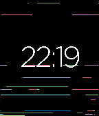

# Pebble.Torn
Missing screen tearing of the OG Pebble?

    

Version 1.0

* It's sluggish.
* It sucks-up battery.
* Time display should still be readable.
* Supports Timeline Quick View.
* Supports 12 and 24 hour time display.

Version 1.1

* More realistic screen tearing.
* Tearing refresh represents seconds.
* Better battery life.

Version 1.2

* Support for Aplite (what's the point?) and Basalt.
